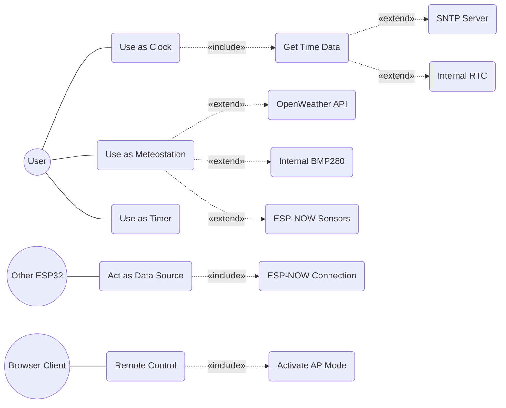

# ESP32 & HMI Multifunction Clock

A multifunction clock capable of joining an ESP-NOW network. 
- **Hardware:** ESP32 MCU + DWIN HMI display + BMP280 sensor.
- **Firmware:** ESP-IDF C code (MCU) and DWIN binary/images (Display).
- **Features:** Time (NTP/RTC), Weather (OpenWeather API), Notifications, ESP-NOW sync, OTA updates via AP mode.

---

## Features & Interfaces

### 1. Main Screen

Displays current time and weather. 
- Requires internet access and OpenWeather API key.
- Temperature is read from the local BMP280 sensor.
- Tap the top right corner for a daily weather forecast.

### 2. Clock & Timer

Configure time manually or via SNTP.
- Tap the top of the screen to toggle time synchronization mode.
- In manual mode, time is saved to the RTC.
- In SNTP mode, configure your time zone offset.
- Fallback time sources: Display's internal RTC or other ESP-NOW devices.
- Includes a built-in timer with an audible alarm.

### 3. Notifications

Configure up to 4 daily notifications.
- An icon and audible alarm will trigger at the set time.
- Hourly chimes are supported (silenced between 23:00 and 06:00).
- Manage notifications via the device screen or the AP Web Server.

### 4. Network Settings

Manage Wi-Fi credentials and API keys.
- Tap **[SEARCH SSID]** to scan for available networks.
- Double-tap a network to select it.

### 5. Customization

Customize text colors across the interface. 
- Tap **[SET COLOR]** to save preferences to non-volatile storage.

### 6. Device Status

Manage global device states:
- **ESPNOW:** Toggle ESP-NOW network synchronization.
- **SECURITY:** Hide or clear saved Wi-Fi passwords.
- **SOUND:** Toggle all device sounds.
- **SNTP:** Toggle network time synchronization.

### 7. Access Point (AP) & Web Server

Activate the built-in Access Point for remote configuration.
- **ESP32 Settings:** Manage OTA updates, network config, time, and notifications.
- **DWIN Settings:** Send commands and flash the DWIN display over the air.

### 8. ESP-NOW Linked Devices

ESP-NOW automatically synchronizes time, weather, and sensor data between nearby Espressif devices without needing a router. Communication is AES-128 encrypted (configure key via `menuconfig`).

---

## Use Cases

## Video Demonstration

